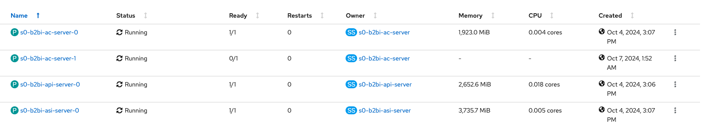

# Containerized Sterling B2Bi Lab - Day 2

## **0. Check on Sterling B2Bi installation**
In this section of the lab, we check on the Sterling B2Bi installation that it completed successfully.

0.1 (login to Openshift)

0.2 (look at the different namespaces/projects - db2, mq, app - that were deployed)

0.3 (go to db2 and mq namespaces one at a time and look at running pods, services for each)

0.4 (go to app namespace and show running pods, secrets (show db credentials), services, routes)

0.5 (in routes, click on app route to bring it up on browser)

---

## **1. Log into Containerized Sterling B2Bi**

---

## **2. Create a Business Process**

---

## **3. Self-heal**
In this section of the lab, we see how RedHat OpenShift performs self healing when a pod is deleted. 

3.1. To delete the pod, login to your cluster with your user credentials by browsing to the `OpenShift web console`.  

3.2. From the administrator section menu on the left, click on the `Workload` drop down menu and click on Pods, and at the top, select the `sterling-b2bi-dev01-app` project.  

3.3. Select one of the `s0-b2bi` pods to delete and end of the row, click the vertical dot menu and click delete. 


      
After the pod is deleted, the pod is reinstantiated and processing work as part of the deployed Sterling B2B Integrator cluster.

    >💡 **NOTE**     
    > While the pod is being terminated a new pod is being created.
    > If you delete on one of the pods or it crashes Openshift will automatically create a new pod to replace the problem pod
      


      


---

## **4. Automatically Scale a Pod**
In this section of the lab, we see how Horizontal Pod Autoscaling works in the OpenShift cluster.  We will see how the Sterling B2B Integrator instance can manually or dynamically scale based on the load on the system.  For this lab we will manually modify pod scaling in the OpenShift console.


### Increase the Replica to 2

4.1. Log into the OpenShift console if you have not already.

4.2 From the administrator section menu on the left, click on the Workload drop down menu and click on StatefulSets, and at the top, select the `sterling-b2bi-dev01-app` project.

4.3 Click on the `s0-b2bi-ac-server` StatefulSet(SS) to open the details page.  In the top menu of the SS select `YAML`

4.4 Do a <CTRL + F>  search for `replicas` to find where to edit and change `replicas` from line 902 to 2

```yaml
spec:
  replicas: 1     <--- change to 2
  ```

4.5 Click save and navigate to pods to observe the scaling

   

---

## **5. Upgrade/Roll Back**
In this section of the lab, we see how you can upgrade with using helm.

Using the `helm upgrade` command we see how the upgrade process is shortend.

5.1. To upgrade the version, first go to the IBM Sterling Console application and check the current version, which is version `6.2.0.2`. 


5.2. Now let's go back to our bastion servers and update the `values.yaml` :

```bash
cd /tmp
```

5.3. Find the name of your `values.yaml` file.  The file name will look like `myb2bi_values-<id>.yml`

```bash
ls
```


5.4.  Inside `myb2bi_values-<id>.yml`, find & set the tag from `6.2.0.2` to `6.2.0.3` and change `enabled` to false under `dataSetup`.  Your files should already be updated
```yaml
global:
...
image:
  repository: cp.icr.io/cp/ibm-b2bi/b2bi
  tag: 6.2.0.2                          <----change to 6.2.0.3   
...
dataSetup:
  enabled: true                         <----change to false
  upgrade: false    
```

5.5. Download the latest helm chart 
```bash
wget https://github.com/IBM/charts/raw/master/repo/ibm-helm/ibm-b2bi-prod-3.0.5.tgz
```

5.6. Start the upgrade
```bash
helm upgrade --timeout 120m0s -f /tmp/myb2bi_values-<id>.yml -n sterling-b2bi-dev01-app s0 /tmp/ibm-b2bi-prod-3.0.5.tgz
```

    >💡 **NOTE**     
    > You may see a warning:
    > "Kubernetes configuration file is group-readable. This is insecure. Location: /tmp/ocp/cluster/auth/kubeconfig"
    > This should not affect the upgrade

Once the output of the process says `STATUS: deployed` we can go back to the console and view the pods.

5.6. To verify the version, simply go to the Sterling app menu and click on the support button in the Sterling Console.**  


We can also verify by going back to our pods and clicking on one of them.  Scroll down to the Containers section and the container image the pod is running.


---

## **6. Log back into upgraded version of Sterling**


---


